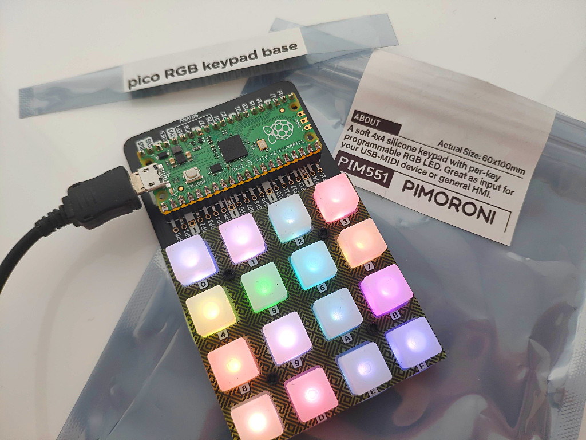

# rgbkeypad-circuitpython
CircuitPython library for the Pimoroni RGB Keypad base - PIM551 - Raspberry Pi Pico.  
This is a 16-key keypad with RGB backlit keys. Find out more about RGB Keypad at the link below.

[Learn more about Pico RGB Keypad at pimoroni.com](https://shop.pimoroni.com/products/pico-rgb-keypad-base)

This library is a fork of the awesome Keybow 2040 library by @SandyJMacDonald, adjusted for the RGB Keypad.

[See the Original Keybow 2040 library](https://github.com/sandyjmacdonald/keybow2040-circuitpython)

The library abstracts away most of the complexity of having to check pin states,
interact with the LED driver library and exposes classes for
individual keys and the whole Keypad (a collection of Key instances).



# Getting started quickly!

You'll need to grab the latest version of Adafruit's Pico CircuitPython firmware, from the link below.

[Download the Adafruit CircuitPython binary for Raspberry Pico and follow install instructions](https://circuitpython.org/board/pimoroni_rgbkeypad/)

The Adafruit Dotstar LED driver library for CircuitPython is a prerequisite for
this RGB Keypad library, so you'll need to download it from GitHub at the link
below, and then drop the `adafruit_dotstar.mpy` folder into the `lib` folder on
your `CIRCUITPY` drive.

[Download the Adafruit DotStar CircuitPython library](https://github.com/adafruit/Adafruit_CircuitPython_DotStar/releases)  
This lib is part of the Adafruit Bundle.  
[Adafruit CircuitPython Bundle](https://github.com/adafruit/Adafruit_CircuitPython_Bundle/releases)

Finally, drop the `rgbkeypad.py` file from this library into the `lib` folder
on your `CIRCUITPY` drive also, and you're all set!

Pick one of the [demos](demos), copy the 
code, and save it in the `code.py` file on your `CIRCUITPY` drive using your 
favourite text editor. As soon as you save the `code.py` file, or make any other
changes, then it should load up and run the code!

You can also check and just slightly adapt SandyJMacDonald's examples from his Keybow lib.  
Apart from the constructor (no need for an I2C port to be provided), all should be compatible.

Some exemples have been converted for rgbkeypad, see [examples](examples)

[Almost compatible Keybow examples](https://github.com/sandyjmacdonald/keybow2040-circuitpython/tree/master/examples)

## Index

* [Library functionality](#library-functionality)
  * [Imports and setup](#imports-and-setup)
  * [The RgbKeypad class](#the-rgbkeypad-class)
  * [An interlude on timing!](#an-interlude-on-timing)
  * [Key presses](#key-presses)
  * [LEDs!](#leds)
  * [LED sleep](#led-sleep)
  * [Attaching functions to keys with decorators](#attaching-functions-to-keys-with-decorators)
  * [Key combos](#key-combos)
* [USB HID](#usb-hid)
  * [Setup](#setup)
  * [Sending key presses](#sending-key-presses)
  * [Sending strings of text](#sending-strings-of-text)
* [USB MIDI](#usb-midi)
  * [Sending MIDI notes](#sending-midi-notes)

# Library functionality

This section covers most of the functionality of the library itself, without
delving into additional functions like USB MIDI or HID (they're both covered
later!)

## Imports and setup

All of your programs will need to start with the following:

```
from rgbkeypad import RgbKeypad

keypad = RgbKeypad()
```

The `RgbKeypad()` class, imported from the `rgbkeypad` module, is instantiated.  
Instantiating this sets up all of the pins, keys and LEDs, and provides access to all of the attributes and methods associated with it.

## The RgbKeypad class

The RgbKeypad class exposes a number of handy attributes and methods. The main one
you'll be interested in is the `.keys` attribute, which is a list of `Key` 
class instances, one for each key.

```
keys = keypad.keys
```

The indices of the keys in that list correspond to their position on the keypad,
staring from the bottom left corner (when the USB connector is at the top), 
which is key 0, going upwards in columns, and ending at the top right corner,
which is key 15.

More about the `Key` class later...

A **super** important method of the `RgbKeypad` class is `.update()` method. It 
updates all of the keys, key states, and other attributes like the time of the
last key press, and sleep state of the LEDs.

**You need to call this method on your `RgbKeypad` class at the very start of each
iteration of your program's main loop, as follows:**

```
while True:
    keypad.update()
```

## An interlude on timing!

Another **super** important thing is **not to include any `time.sleep()`s in 
your main loop!** Doing so will ruin the latency and mean that you'll miss key
press events. Just don't do it.

If you need introduce timed events, then you have to go about it in a slightly
(!!) roundabout fashion, by using `time.monotonic()` a constantly incremented
count of seconds elapsed, and use it to check the time elapsed since your last
event, for example you could do this inside your `while True` loop:

```
time_interval = 10

# An event just happened!

time_last_fired = time.monotonic()
time_elapsed = 0

# ... some iterations later

time_elapsed = time.monotonic() - time_last_fired

if time_elapsed > time_interval:
    # Fire your event again!
```

There's a handy `keypad.time_of_last_press` attribute that allows you to quickly
check if a certain amount of time has elapsed since any key press, and that
attribute gets updated every time `keypad.update()` is called.

## Key presses

There are a few ways that you can go about detecting key presses, some
global methods on the `RgbKeypad` class instance, and some on the `Key` class
instances themselves.

### RgbKeyoad class methods for detecting presses and key states

`keypad.get_states()` will return a list of the state of all of the keys, in 
order, with a state of `0` being not pressed, and `1` being pressed. You can
then loop through that list to do whatever you like.

`keypad.get_pressed()` will return a list of the key numbers (indices in the 
list of keys) that are currently pressed. If you only care about key presses,
then this is an efficient way to do things, especially since you have all the
key numbers in a list.

`keypad.any_pressed()` returns a Boolean (`True`/`False`) that tells you whether
any keys are currently being pressed. Handy if you want to attach a behaviour to
all of the keys, which this is effectively a proxy for.

`keypad.none_pressed()` is similar to `.any_pressed()`, in that it returns a 
Boolean also, but... you guessed it, it returns `True` if no keys are being
pressed, and `False` if any keys are pressed.

### Key class methods for detecting key presses

If we want to check whether key 0 is pressed, we can do so as follows:

```
keys = keypad.keys()

while True:
    keypad.update()

    if keys[0].pressed:
        # Do something!
```

The `.pressed` attribute returns a Boolean that is `True` if the key is pressed
and `False` if it is not pressed.

`key.state` is another way to check the state of a key. It will equal `1` if the
key is pressed and `0` if it is not pressed.

If you want to attach an additional behaviour to your key, you can use 
`key.held` to check if a key is being key rather than being pressed and released
quickly. It returns `True` if the key is held and `False` if it is not.

The default hold time (after which `key.held` is `True`) for all of the keys is
0.75 seconds, but you can change `key.hold_time` to adjust this to your liking, 
on a per key basis.

This means that we could extend the example above to be:

```
keys = keypad.keys()

while True:
    keypad.update()

    if keys[0].pressed:
        # Do something!

    if keys[0].held:
        # Do something else!
```

The [reactive-press.py example](examples/reactive-press.py) shows in more detail
how to handle key presses.

## LEDs!

LEDs can be set either globally for all keys, using the `RgbKeypad` class instance,
or on a per-key basis, either through the `RgbKeypad` class, or using a `Key` class
instance.

To set all of the keys to the same colour, you can use the `.set_all()` method
of the `RgbKeypad` class, to which you pass three 0-255 integers for red, green, 
and blue. For example, to set all of the keys to magenta:

```
keypad.set_all(255, 0, 255)
```

To set an individal key through your `RgbKeypad` class instance, you can do as
follows, to set key 0 to white:

```
keypad.set_led(0, 255, 255, 255)
```

To set the colour on the key itself, you could do as follows, again to set key
0 to white:

```
keypad.keys[0].set_led(255, 255, 255)
```

A key retains its RGB value, even if it is turned off, so once a key has its 
colour set with `key.rgb = (255, 0, 0)` for example, you can turn it off using
`key.led_off()` or even `key.set_led(0, 0, 0)` and then when you turn it back on
with `key.led_on()`, then it will still be red when it comes back on.

As a convenience, and to avoid having to check `key.lit`, there is a 
`key.toggle_led()` method that will toggle the current state of the key's LED 
(on to off, and _vice versa_).

There's a handy `hsv_to_rgb()` function that can be imported from the 
`rgbkeypad` module to convert an HSV colour (a tuple of floats from 0.0 to 1.0)
to an RGB colour (a tuple of integers from 0 to 255), as follows:

```
from rgbkeypad import hsv_to_rgb

h = 0.5  # Hue
s = 1.0  # Saturation
v = 1.0  # Value

r, g, b = hsv_to_rgb(h, s, v)
```

The [rainbow.py example](examples/rainbow.py) shows a more complex example of
how to animate the keys' LEDs, including the use of the `hsv_to_rgb()` function.

==============

## LED sleep

The `RgbKeypad` class has an `.led_sleep_enabled` attribute that is disabled (set to
`False`) by default, and an `.led_sleep_time` attribute (set to 60 seconds by
default) that determines how many seconds need to elapse before LED sleep is 
triggered and the LEDs turn off.
 
The time elapsed since the last key press is constantly updated when 
`keypad.update()` is called in your main loop, and if the `.led_sleep_time` is
exceeded then LED sleep is triggered.

Because keys retain their RGB values when toggled off, when asleep, a tap on any
key will wake all of the LEDs up at their last state before sleep.

Enabling LED sleep with a sleep time of 10 seconds could be done as simply as:

```
keypad.led_sleep_enabled = True
keypad.led_sleep_time = 10
```

There's also a `.sleeping` attribute that returns a Boolean, that you can check 
to see whether the LEDs are sleeping or not.

## Attaching functions to keys with decorators

There are three decorators that can be attached to functions to link that 
function to, i) a key press, ii) a key release, or iii) a key hold.

Here's an example of how you could attach a decorator to a function that lights
up that key yellow when it is pressed, turns all of the LEDs on when held, and 
turns them all off when released:

```
from rgbkeypad import RgbKeypad

keypad = RgbKeypad()
keys = keypad.keys

key = keys[0]
rgb = (255, 255, 0)
key.rgb = rgb

@keypad.on_press(key)
def press_handler(key):
    key.led_on()

@keypad.on_release(key)
def release_handler(key):
    keypad.set_all(0, 0, 0)

@keypad.on_hold(key)
def hold_handler(key):
    keypad.set_all(*rgb)

while True:
    keypad.update()
```

The [decorators.py example](examples/decorators.py) has another example of how
to use the `.on_hold()` decorator to toggle LEDs on and off when a key is held.

## Key combos

Key combos can provide a way to add additional behaviours to keys that only get
triggered if a combination of keys is pressed. The best way to achieve this is
using the `.held` attribute of a key, meaning that the key can also have a 
`.pressed` behaviour too.

Here's a brief example of how you could do this inside your main loop, with key
0 as the modifier key, and key 1 as the action key:

```
keys = keypad.keys

modifier_key = keys[0]
action_key = keys[1]

while True:
    keypad.update()

    if modifier_key.held and action_key.pressed:
        # Do something!
```

Of course, you could chain these together, to require two modifer keys to be
held and a third to be pressed, and so on...

The [colour-picker.py example](examples/colour-picker.py) has an example of
using a modifier key to change the hue of the keys.

# USB HID

This covers setting up a USB HID keyboard and linking physical key presses to 
keyboard key presses on a connected computer.

## Setup

USB HID requires the `adafruit_hid` CircuitPython library. Download it from the
link below and drop the `adafruit_hid` folder into the `lib` folder on your 
`CIRCUITPY` drive.

[Download the Adafruit HID CircuitPython library](https://github.com/adafruit/Adafruit_CircuitPython_HID)

You'll need to connect your RgbKeypad to a computer using a USB cable, just like
you would with a regular USB keyboard.

## Sending key presses

Here's an example of setting up a keyboard object and sending a `0` key press
when key 0 is pressed, using an `.on_press()` decorator:

```
import board
from rgbkeypad import RgbKeypad

import usb_hid
from adafruit_hid.keyboard import Keyboard
from adafruit_hid.keyboard_layout_us import KeyboardLayoutUS
from adafruit_hid.keycode import Keycode

keypad = RgbKeypad()
keys = keypad.keys

keyboard = Keyboard(usb_hid.devices)
layout = KeyboardLayoutUS(keyboard)

key = keys[0]

@keypad.on_press(key)
def press_handler(key):
    keyboard.send(Keycode.ZERO)

while True:
    keypad.update()
```

You can find a list of all of the keycodes available at the
[HID CircuitPython library documentation here](https://circuitpython.readthedocs.io/projects/hid/en/latest/api.html#adafruit-hid-keycode-keycode).

As well as sending a single keypress, you can send multiple keypresses at once,
simply by adding them as additional arguments to `keyboard.send()`, e.g. 
`keyboard.send(Keycode.A, Keycode.B)` and so on.

## Sending strings of text

Rather than the inconvenience of sending multiple keycodes using
`keyboard.send()`, there's a different method to send whole strings of text at
once, using the `layout` object we created.

```
import board
from rgbkeypad import RgbKeypad

import usb_hid
from adafruit_hid.keyboard import Keyboard
from adafruit_hid.keyboard_layout_us import KeyboardLayoutUS
from adafruit_hid.keycode import Keycode

keypad = RgbKeypad()
keys = keypad.keys

keyboard = Keyboard(usb_hid.devices)
layout = KeyboardLayoutUS(keyboard)

key = keys[0]

@keypad.on_press(key)
def press_handler(key):
    layout.write("Pack my box with five dozen liquor jugs.")

while True:
    keypad.update()
```

A press of key 0 will send that whole string of text at once!

Be aware that strings sent like that take a little while to  virtually "type",
so you might want to incorporate a delay using  `keypad.time_of_last_press`, 
and then check against a `time_elapsed` variable created with 
`time_elapsed = time.monotonic() - keypad.time_of_last_press`.

Also, be aware that the Adafruit HID CircuitPython library only currently 
supports US Keyboard layouts, so you'll have to work around that and map any
keycodes that differ from their US counterpart to whatever your is.

There is ongoing work on that subject, see https://github.com/adafruit/Adafruit_CircuitPython_HID/pull/61

# USB MIDI

This covers basic MIDI note messages and how to link them to key presses.

## Setup

USB MIDI requires the `adafruit_midi` CircuitPython library. Download it from
the link below and then drop the `adafruit_midi` folder into the `lib` folder on
your `CIRCUITPY` drive.

[Download the Adafruit MIDI CircuitPython library](https://github.com/adafruit/Adafruit_CircuitPython_MIDI)

You'll need to connect your Keypad with a USB cable to a computer running a
software synth or DAW like Ableton Live, to a hardware synth that accepts USB
MIDI, or through a MIDI interface that will convert the USB MIDI messages to
regular serial MIDI through a DIN connector.

## Sending MIDI notes

Here's a complete, minimal example of how to send a single MIDI note (middle C,
or MIDI note number 60) when key 0 is pressed, sending a note on message when
pressed and a note off message when released.

```
from rgbkeypad import RgbKeypad

import usb_midi
import adafruit_midi
from adafruit_midi.note_off import NoteOff
from adafruit_midi.note_on import NoteOn

keypad = RgbKeypad()
keys = keypad.keys

midi = adafruit_midi.MIDI(midi_out=usb_midi.ports[1], out_channel=0)

key = keys[0]
note = 60
velocity = 127

was_pressed = False

while True:
    keypad.update()

    if key.pressed:
        midi.send(NoteOn(note, velocity))
        was_pressed = True
    elif not key.pressed and was_pressed:
        midi.send(NoteOff(note, 0))
        was_pressed = False
```

There'a more complete example of how to set up all of RgbKeypad's keys with 
associated MIDI notes using decorators in the original Keybow Library.

